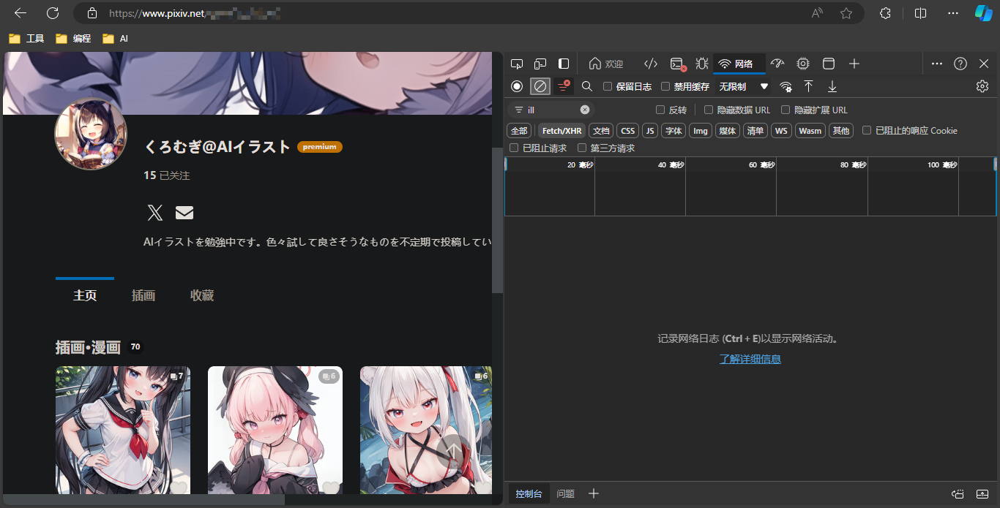
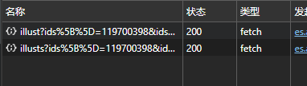

# KTool

本程序用于爬取`Pixiv`的图片数据，不会储存图片，只是储存图片的Tag、Title之类的，并且储存为一个标准json文件

为了与其他的各种API兼容，我在数据库方便也做了相关调整，目前来说，应该是各种数据库都可以调用的，不过建议还是使用我自己的API：`Suzumi`

## 怎么获取？

本程序分为`Console`版本和正常的版本，正常版本会开启Web前端，Console则是在控制台中运行，如果要效率优先，建议使用Console，因为可以直接复制，回车，就下载完了；但是如果对控制台使用起来没有那么的得心应手，还是使用正常版本啦，下面就开始介绍正常的流程

首先，打开pixiv，并登录自己的账号，假设我需要根据User进行获取，首先打开一个用户的页面，随后打开开发者人员工具，可以看到这样的页面：

搜索ill，并且选择XHR选项，随后往下滑，找到查看全部，点击，就会在右边看到加载出来的内容了！

因为是User，我们需要的是下面这个有User的

直接复制链接地址，进入工具中，粘贴，点击开始获取就好啦~

进度条可以在控制台中查看，前端只能看到正在加载（懒了）